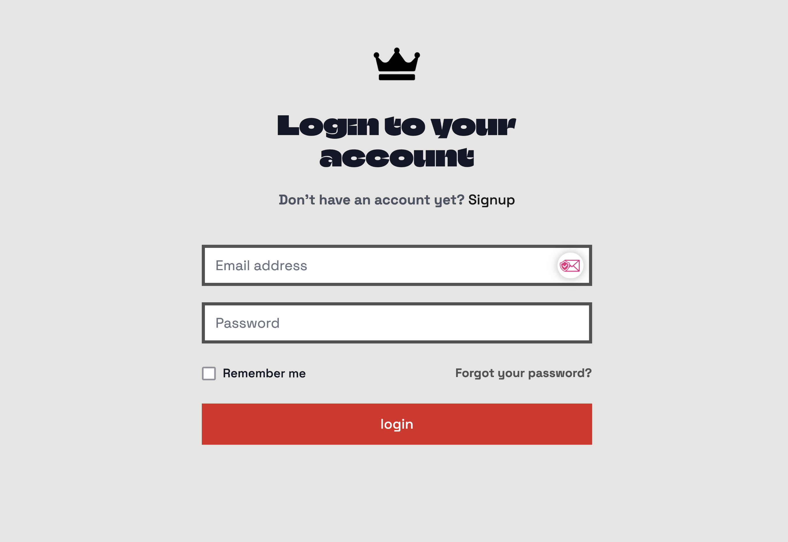
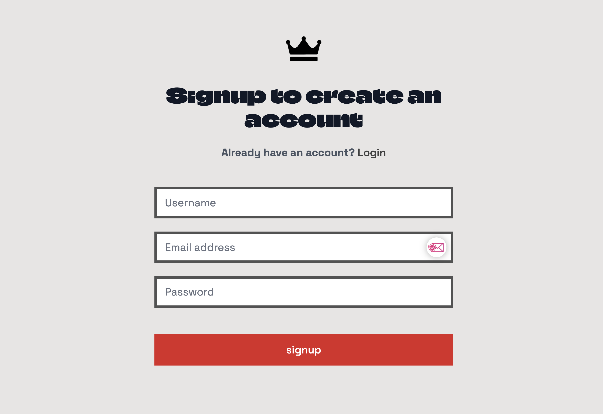
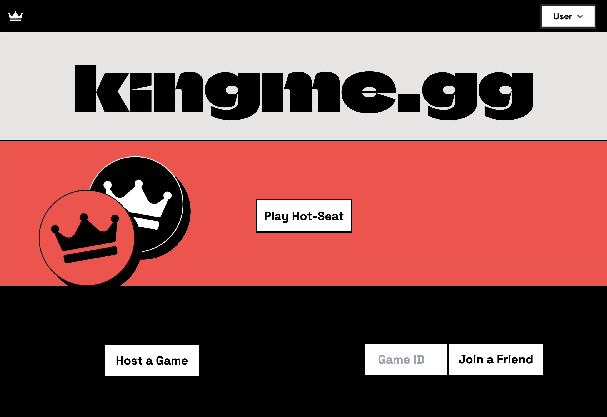
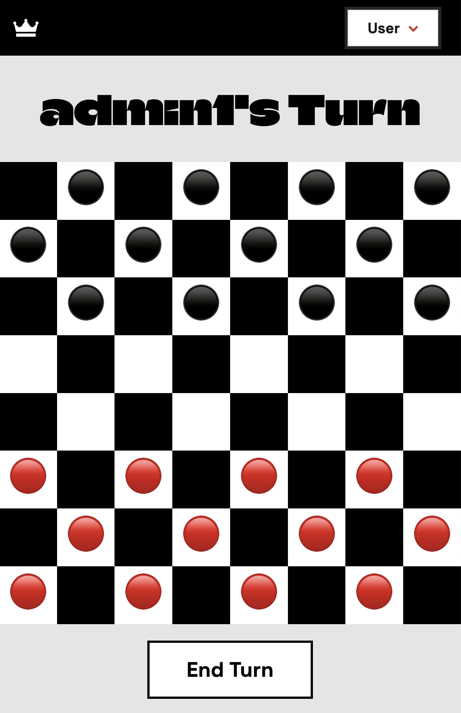
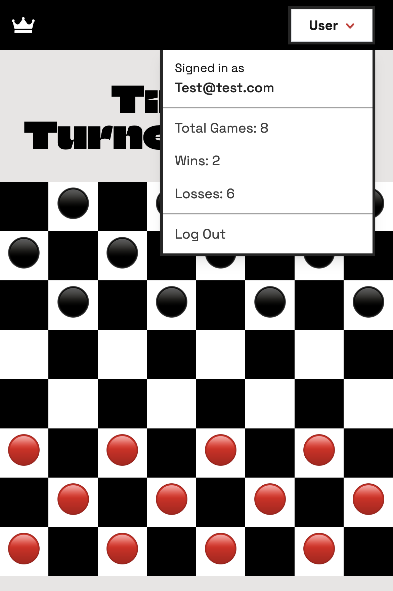
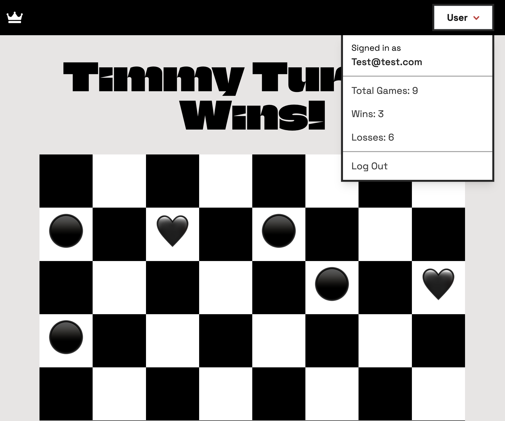

# [kingme.gg](https://kingme.gg/)

 

 

A fun game to play with a friend in your web browser!
 

## Project Status
Submitted for evaluation.
 

## Project Deployed
[kingme.gg](https://kingme.gg/)

[github.com/jakubcic/kingme](https://github.com/jakubcic/kingme)
 

## Table of Contents
* [Description](#description)
* [Technologies Used](#technologies-used)
* [User Story](#user-story)
* [Challenges](#challenges)
* [Roadmap](#roadmap)
* [Contributors](#contributors)
* [Acknowledgements](#acknowledgements)
 

## Description
kingme.gg is a checkers web application built with React, Node, Express, MongoDB, GraphQL and TailwindCSS.

## Screenshots of Webpage

	
	

 

	
	
	

 

## Technologies Used
<ul>
<li>We chose Vite as our build tool and bundler because it is fast, easy to use, and has a small footprint. It also has a built-in dev server and hot module replacement.
<li>Kingme.gg uses React for the front end.
<li>The application has a GraphQL API with a Node.js and Express.js server, and uses queries and mutations for retrieving, adding, updating, and deleting data.
<li>We used a NoSQL database, MongoDB, and the Mongoose ODM.
<li>For user authentication we used JSON Web Tokens.
<li>We deployed the application to Heroku and used a cloud hosted MongoDB Atlas database.
</ul>
 

## User Story
<ul>
<li>As a user I want to play checkers online with a friend and keep track of my wins and losses.
</ul>
 

## Challenges
We had a lot of challenges during the build of this project. Some of the more significant ones were:

 - **Socket.io**: This is a library we looked into to using for the WebSocket protocol, but online multiplayer was a far greater challenge than we had anticipated. If we had more time, we would have liked to have implemented this. We plan to continue working on this project and will add this feature in the future.
 - We started with mockups using HTML and CSS and had to refactor these into React components using a mix of TailwindCSS and custom CSS.
 - **Game Logic**: Throughout the development process the game logic had to be constantly updated to produce a full-fledged game and squash bugs as we found them.
 - **Deployment**: Deploying to Heroku was not as quick or easy as we would've liked. Since we chose to use Vite we had to use a different build script that what we're used to and made some changes that we didn't anticipate. We had to change some scripts in the package.json and adjust some environment varibles to get it to deploy properly. Once we got heroku to build the app we still weren't able to get it to run properly. This thankfully was a quick fix: we needed to update the path in our *server.js* file to the `dist` directory instead of the `build` directory.
 

## Roadmap
This is a responsive, interactive app using many technologies to create a fun game and user experience. Future developments could include:

- [ ] Unlockable color choices for the game board and checker pieces based on wins.
- [ ] Fully working online multiplayer mode using web sockets.
- [ ] In game chat to talk with your opponent when hosting an online game.
- [ ] One player versus the computer mode with a difficulty setting. Potentially hooking into the ChatGPT API to make the opponent's moves.
 

## Contributors
- [Ricky Aponte](https://github.com/Eaponte24)
- [Emily Bernard](https://github.com/EmilyBernard )
- [Jakub Cichon](https://github.com/jakubcic)
- [Ann Hixson](https://github.com/AnnHixson)
- [Chris Lemmon](https://github.com/theLemmonade)
 

## Acknowledgements
Thanks to:
- Instructor Kris Renaldi for his invaluable help during class sessions and office hours.
- Tutors for their help in troubleshooting different issues.
